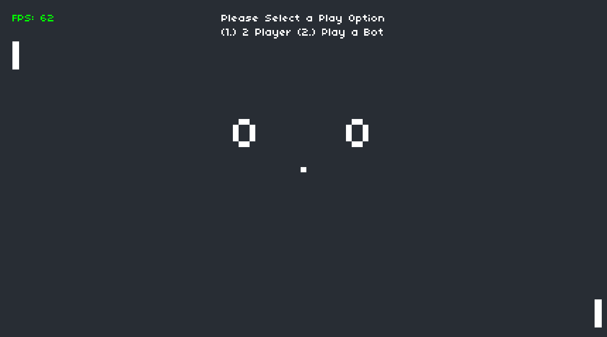

# Pong
This is a pong clone created by the CS50x Harvard Course. I did not create this code, however I extended it as part of a project. 
The code that I have done is documented in the code and the features I added are below.

## Features I added:
- Implement a Basic AI to play against
- Give options for 2 player or to vs the AI
---

### Adapted Files
- main.lua